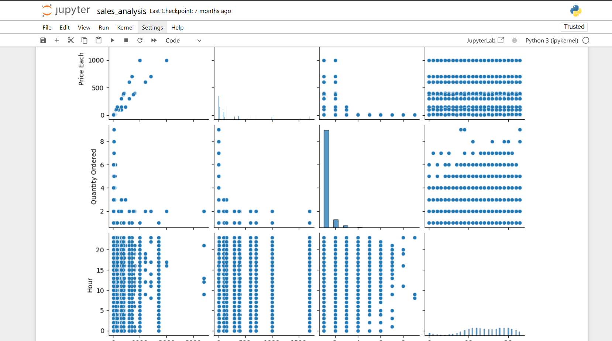

# 🛍️ Sales Data Analysis

This repository contains a Jupyter Notebook project focused on analyzing sales data to uncover valuable business insights.

**📌 Purpose:**  
Analyze sales data to identify trends, top 5 best-selling products, and key revenue metrics for business decision-making.

---

## 📘 View the Notebook

> Click on the `Sales_Data_Analysis.ipynb` file above to view the full code and output rendered directly in GitHub.

---

## 🧰 Tools & Libraries Used

- `pandas` – for data manipulation and preprocessing  
- `seaborn` – for visualizations and trend analysis  
- `matplotlib` – for plotting charts and graphs  

---

## 📊 Project Highlights

- Cleaned and explored raw sales data
- Visualized monthly and yearly sales trends
- Identified the **top 5 best-selling products**
- Calculated revenue metrics across products and categories
- Provided visual insights to support **data-driven decision-making**

---

## 📁 File Structure

- `Sales_Data_Analysis.ipynb` – Jupyter Notebook with full analysis and visuals  

---
## 📈 Sample Output

Here is a preview of one of the key charts from the analysis:




## 🚀 How to Use This Project

To run this notebook locally:

1. Clone the repo:
   ```bash
   git clone https://github.com/sirdeladem/Sales_Data_Analysis.git
